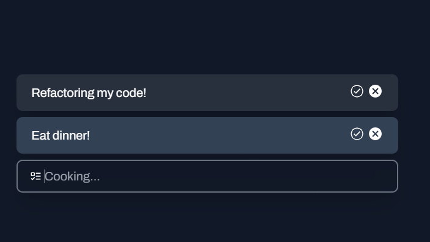

# DailyDoings - Todo-List App

### 👾 Tech stack

-   ` React`
-   `TypeScript`
-   `TailwindCSS`
-   `Motion`

### 🎯Features

-   Create Task: add tasks with ease.
-   Edit Task: update existing tasks to ensure task accuracy.
-   Delete Task: remove tasks that are no longer needed to ensure a clean list.

## 🚦Running the Project

To run the project in your local environment, follow these steps:

1. Clone the repository to your local machine.
2. Run `npm install` or `yarn` in the project directory to install the required dependencies.
3. Run `npm run start` or `yarn start` to get the project started.
4. Open [http://localhost:5173](http://localhost:5173) (or the address shown in your console) in your web browser to view the app.
